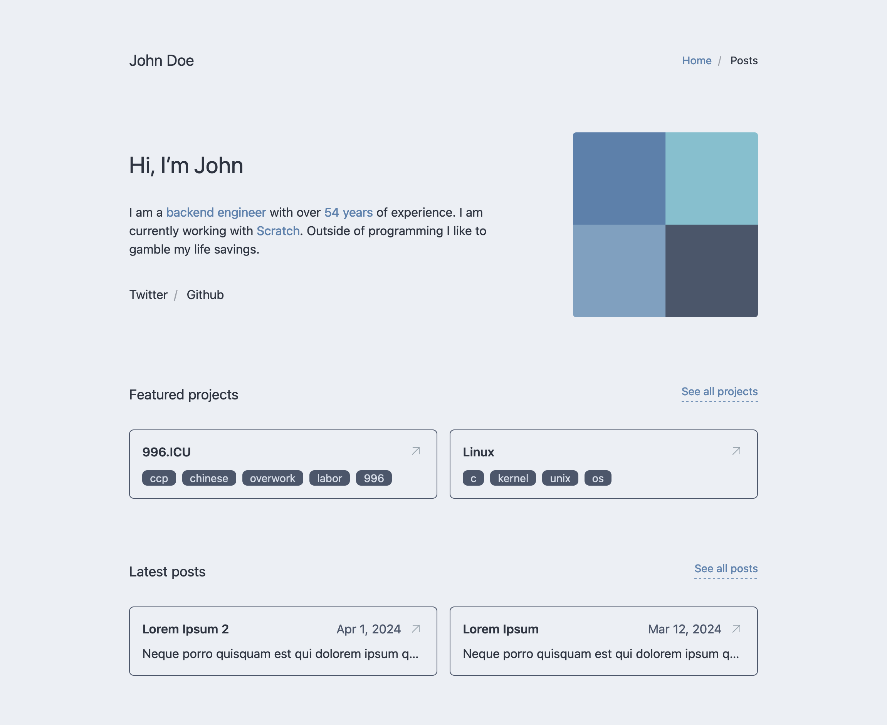

# Astro Minimal Portfolio

[](https://minimal-portfolio.demo.tahir.sh/)

## Project Structure

```text
portfolio/
├── public/
│   └── favicon.svg
├── src/
│   ├── assets/
│   │   └── icons, etc.
│   ├── components/
│   │   └── boxes
│   ├── layouts/
│   │   └── Layout.astro
│   ├── pages/
│   │   ├── posts/
│   │   │   └── index.astro
│   │   ├── index.astro
│   │   └── 404.astro
│   ├── content/
│   │   ├── posts/
│   │   │   ├── lorem-ipsum.md
│   │   │   └── lorem-ipsum-2.md
│   │   └── config.ts
│   └── config.ts
└── LICENSE
```

Make sure to fill in the `config.ts` file in the `src` folder.

This project is build with TailwindCSS and DaisyUI so you can easily customize it.

## Commands

All commands are run from the root of the project, from a terminal:

| Command                    | Action                                           |
| :------------------------- | :----------------------------------------------- |
| `pnpm install`             | Installs dependencies                            |
| `pnpm run dev`             | Starts local dev server at `localhost:4321`      |
| `pnpm run build`           | Build your production site to `./dist/`          |
| `pnpm run preview`         | Preview your build locally, before deploying     |
| `pnpm run astro ...`       | Run CLI commands like `astro add`, `astro check` |
| `pnpm run astro -- --help` | Get help using the Astro CLI                     |

test